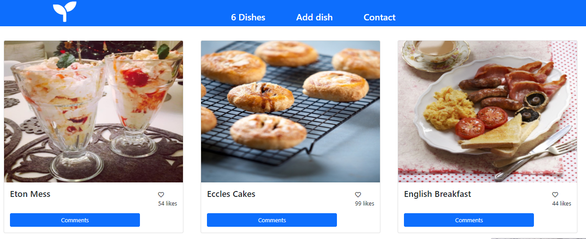

# javaScript-capstone-project

# Lemonade

> Building A food rating App

This is about building web application based on an external API. we selected an API that provides data about a meals and then build the webapp around it. The webapp have 2 user interfaces the home page showing a list of items that you can like, and the popup window with more data about an item that you can use to comment on it or reserve it for a period of time.

## Built With

- HTML
- CSS
- JavaScript
- Webpack
- JestLibrary

## Live Demo

[Live Demo Link](https://aliabbani.github.io/javaScript-capstone-project/dist)

## Video Link

[Project video Link](https://drive.google.com/file/d/1jUQ8A0Iez3eQBxhPhrEkIRiX9xf_o5kl/view?usp=sharing)

## Getting Started

### To get a local copy up and running follow these simple example steps.

- Clone the repo with `git clone git@github.com:aliabbani/javaScript-capstone-project.git`
- Open your terminal or command line
- Run `git clone` and paste the link
- Open the folder with your code editor
- Create a branch to work on
- Run `npm install`
- Run `npm run build`
- Run `npm run start` to launch the server.

### You can view the app using the 'live demo' above.

## Authors

👤 **Elmar AbdulKarimov**

## Elmar's Profile

- GitHub: [@githubhandle](https://github.com/elmar8287)
- Twitter: [@twitterhandle](https://twitter.com/EAbdulkarimov)
- LinkedIn: [LinkedIn](/)

👤 **Ali Abbani**

## Ali's Profile

- GitHub: [@githubhandle](https://github.com/aliabbani)
- Twitter: [@twitterhandle](https://twitter.com/aliabbani)
- LinkedIn: [LinkedIn](https://www.linkedin.com/in/ali-abbani-8b6246150/)

## 🤝 Contributing

Contributions, issues, and feature requests are welcome!

Feel free to check the [issues page](https://github.com/aliabbani/javaScript-capstone-project/issues).

## Show your support

Give a ⭐️ if you like this project!

## Acknowledgments

- A special thanks to Microverse for inspiring this project. We are indebted to you all at Microverse
- A special thanks goes to all our peers at Microverse for being there for us.

## 📝 License

This project is [MIT](/) licensed.
